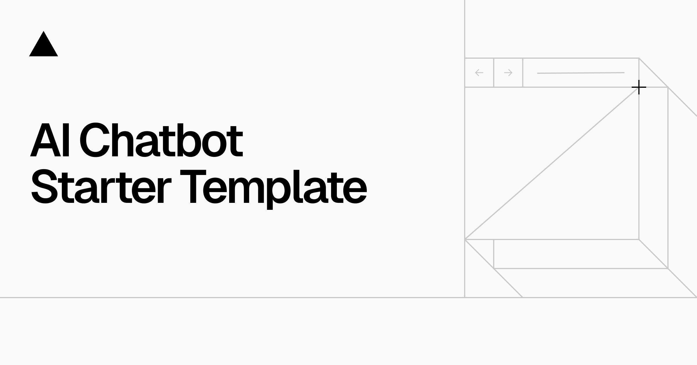

<a href="https://chat.vercel.ai/">
  
  <h1 align="center">Course Recommender Chatbot</h1>
</a>

<p align="center">
  A Course Recommender Chatbot built on Vercel's Open-Source AI Chatbot Template.
</p>

<p align="center">
  <a href="#features"><strong>Features</strong></a> ·
  <a href="#model-providers"><strong>Model Providers</strong></a> ·
  <a href="#running-locally"><strong>Running locally</strong></a>
</p>
<br/>

## Features

- **Roadmap Generator** - Creates personalized learning roadmaps based on user goals
- **User Profile Dashboard** - Track learning progress and course completions
- [Next.js](https://nextjs.org) App Router with React Server Components
- [AI SDK](https://sdk.vercel.ai/docs) for generating text and structured content
- [shadcn/ui](https://ui.shadcn.com) with Tailwind CSS styling
- Data Persistence with Vercel Postgres and Vercel Blob
- Authentication using NextAuth.js
- Full Calendar integration for scheduling and event management

## Model Providers

This chatbot supports multiple AI model providers:
- OpenAI (default with `gpt-4o`)
- Google's Gemini models
- Anthropic, Cohere, and more via the AI SDK

## Running locally

1. Install Vercel CLI: `npm i -g vercel`
2. Link local instance with Vercel and GitHub accounts: `vercel link`
3. Download your environment variables: `vercel env pull`

```bash
pnpm install
pnpm dev
```

Your app should now be running on [localhost:3000](http://localhost:3000/).
